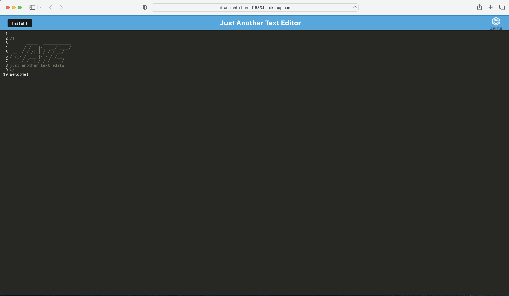

# PWA-Text

## Technology
JavaScript | CSS | HTML| Node.js | Express | webpack | workbox |

https://ancient-shore-11533.herokuapp.com

## Description
The motivation behind this project was to build a text editor that would run in the browser, so that one could create notes or code snippets with or without internet connection. One could easily retrieve notes without internet connection for later use. starter code was provided within this.

## Installation
In order to install you would do the following:
1. Navigate to Heroku website
2. Click on 'Install!" button 
3. click "ok/Yes" to install and enjoy application!

## License
N/A